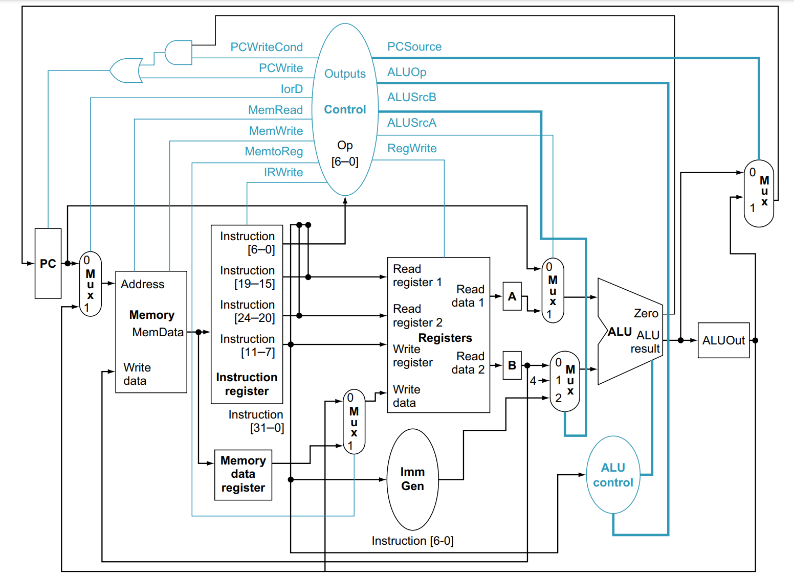

# RISCO 5

Processador [RISC-V](https://riscv.org/) de multi ciclo com implementação RV32I construído em alguns dias de folga.

## Implementação

O processador foi implementado utilizando Verilog HDL, e tendo como base a implementação multi ciclo disponível no livro [Computer Organization and Design RISC-V Edition: The Hardware Software Interface (The Morgan Kaufmann Series in Computer Architecture and Design) - 2º Edition](https://www.amazon.com/Computer-Organization-Design-RISC-V-Architecture/dp/0128203315)

## Software

O diretório software possui alguns exemplos e testes escritos em Assembly e os seus respectivos arquivos de memória, além disso está disponível um script para transformar Assembly em arquivo de memória.

## Testes

O diretório tests possui alguns testes construídos utilizando o [Iverilog](https://steveicarus.github.io/iverilog/), todos os testes lá disponíveis são compatíveis com o mesmo.

## Familia Risco 5:

- Baby Risco 5 - RV16I: Ainda especulativo
- Pequeno Risco 5 - RV32I: [https://github.com/JN513/Pequeno-Risco-5/](https://github.com/JN513/Pequeno-Risco-5/)
- Risco 5 - RV32I: [https://github.com/JN513/Risco-5](https://github.com/JN513/Risco-5)
- Grande Risco 5 - RV32I: Ainda especulativo
- Risco 5 bodybuilder - RV64I: Ainda especulativo

## Dúvidas e sugestões

Em caso de dúvida ou sugestão fique a vontade para utilizar a seção [ISSUES](https://github.com/JN513/Risco-5/issues) do github. Caso se sinta à vontade e queira contribuir com algo qualquer Pull request e bem vindo, todos os [Pull requests](https://github.com/JN513/Risco-5/pulls) serão revisados e se possível mergeados.

## Licença

A licença utilizada no projeto é a [MIT](https://opensource.org/license/mit/) que concede total liberdade para utilização do mesmo.
