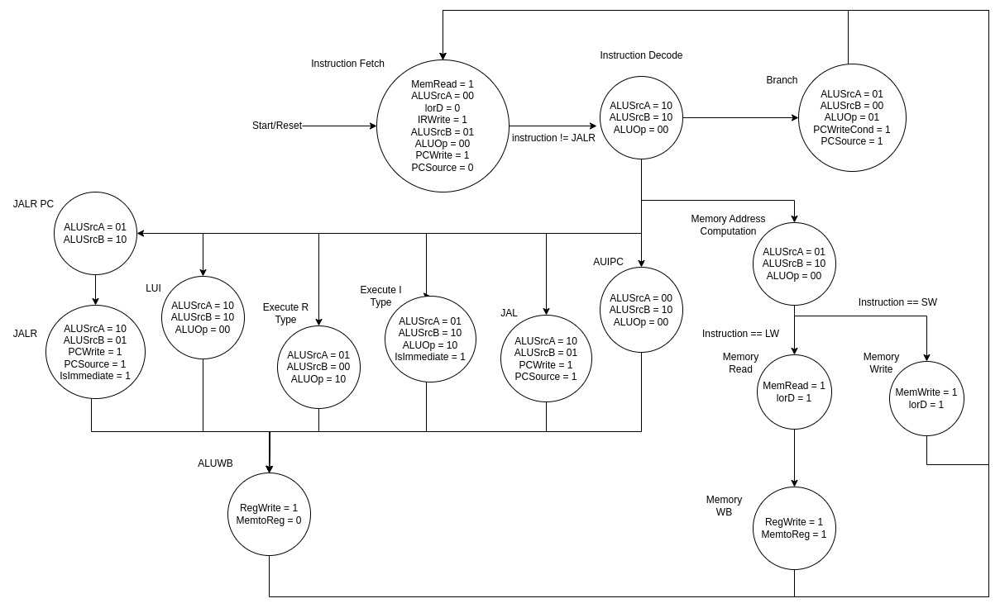
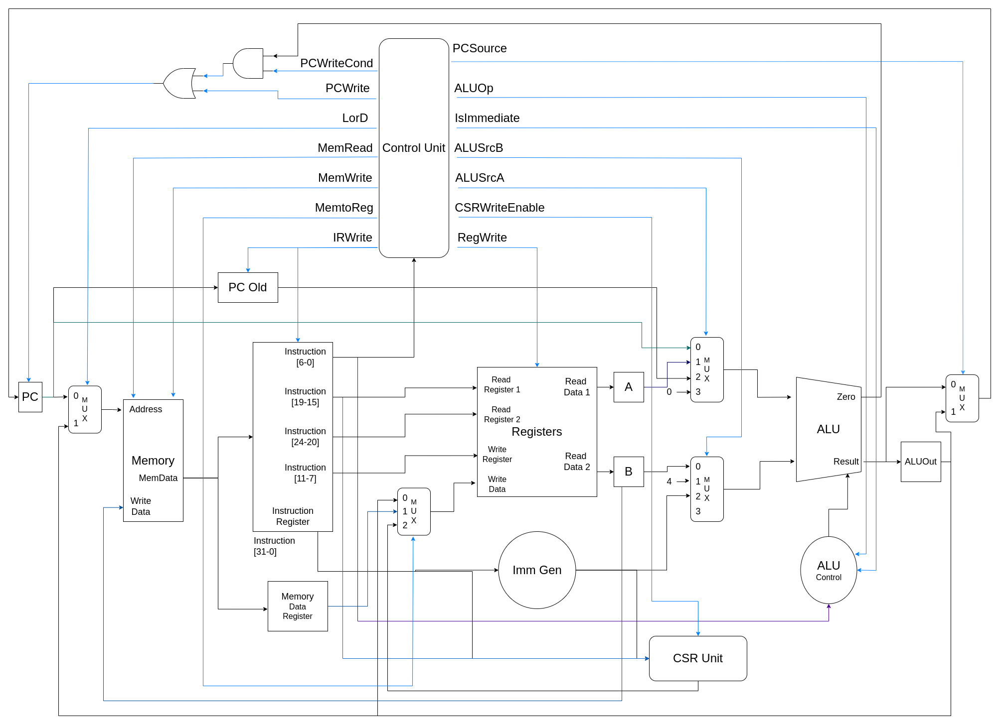

# Documentação Risco 5

<p align="center">

</p>

Autor: Julio Nunes Avelar

Autor da logo: [Mateus luck](https://www.instagram.com/mateusluck/)

Licença Hardware: [CERN-OHL-P-2.0](https://github.com/JN513/Risco-5/blob/main/LICENSE)

Licença Software: [MIT](https://github.com/JN513/Risco-5/blob/main/software/LICENSE-MIT)

Sinais e pinagem dos módulos: [signals.md](signals.md)

Lista de instruções suportadas: [instructions.md](instructions.md)

## Familia Risco 5:

- Baby Risco 5 - RV16I: Ainda especulativo
- Pequeno Risco 5 - RV32I: [https://github.com/JN513/Pequeno-Risco-5/](https://github.com/JN513/Pequeno-Risco-5/)
- Risco 5 - RV32I: [https://github.com/JN513/Risco-5](https://github.com/JN513/Risco-5)
- Grande Risco 5 - RV32I: Ainda especulativo
- Risco 5 bodybuilder - RV64I: Ainda especulativo

## Testes

O diretório testes possui alguns testes para os módulos do projeto. Os testes foram feitos para serem utilizados para o [Iverilog](https://steveicarus.github.io/iverilog/), para executar os testes basta utilizar o iverilog e o vpp, como no exemplo abaixo:

```bash
iverilog -o build/core_test.o -s core_tb src/core/* src/peripheral/memory.v tests/core_test.v
vvp build/core_test.o
```

## Software

O diretório software possui pelo menos um exemplo em assembly para cada instrução suportada, além disso possui um arquivo de memória para cada exemplo. Na raiz do diretório está disponível um script para conversão de assembly em arquivo de memória, o mesmo pode ser utilizado como no exemplo abaixo:

```bash
./generate_mem.sh
>addi
```

## FPGA

O projeto oferece suporte a teste em algumas FPGAs, sendo elas:

- Colorlight i9 - ECP5 45F
- Tangnano 20k

Os exemplos estão disponíveis no diretório FPGA. Para FPGAs sipeed (Tangnano 9k e 20k) os exemplos foram feitos utilizando a IDE gowin, e para as FPGA Lattice/ColorLight os exemplos foram feitos utilizando o Yosys + NextPNR e podem ser sintetizados e flashado utilizando o makefile disponível nos diretórios.

## Maquina de estados da unidade de controle e Esquemático

#### Maquina de estados da unidade de controle



#### Esquemático do processador

**Esquemático atual**


**Esquemático Inicial**


## Debug
