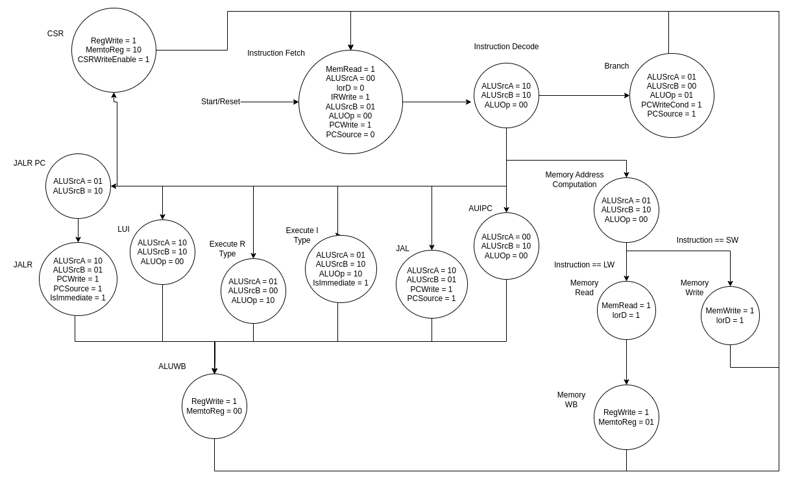
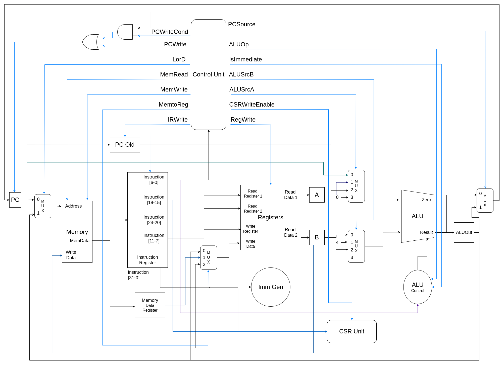

# Risco-5 Processor Core

## Introduction

Risco-5 is a 32-bit RISC-V core that implements the basic instruction set of the RISC-V RV32I/E[M]. Risco-5 is a multi-cycle, in-order processor without a pipeline. It was designed to be simple and easy to use, making it useful in various systems.

## Source Files

The Risco-5 files are available in the "core/" folder within the "src/" directory, with the top module located in the core.v file.

## Parameters

| Name         | Size    | Description        |
|--------------|---------|--------------------|
| BOOT_ADDRESS | 32 bits | Boot address       |

## Signals

| Name              | Direction | Size    | Description                                                       |
|-------------------|-----------|---------|-------------------------------------------------------------------|
| clk               | input     | 1 bit   | Clock signal                                                      |
| halt              | input     | 1 bit   | Halts the processor execution                                     |
| reset             | input     | 1 bit   | Reset signal                                                      |
| memory_response   | input     | 1 bit   | Memory bus response; the core waits until it is 1                 |
| memory_read       | output    | 1 bit   | Enables memory read                                               |
| memory_write      | output    | 1 bit   | Enables memory write                                              |
| write_data        | output    | 32 bits | Values exiting the core                                           |
| read_data         | input     | 32 bits | Values coming from memory                                         |
| address           | output    | 32 bits | Memory address                                                    |
| option            | output    | 3 bits  | Format to be read from memory                                     |

## Instance Example

Below is an example of how to instantiate the Risco-5 core in a Verilog module:

```verilog
Core #(
    .BOOT_ADDRESS(32'h00000000) // Boot address - 32 bits
) Core_inst (
    /* control */
    .clk(clk), // Clock signal - 1 bit
    .halt(halt), // Halts the processor execution - 1 bit
    .reset(reset), // Reset signal - 1 bit
    /* Data */
    .memory_response(memory_response), // Memory bus response, the core waits until it is 1 - 1 bit
    .memory_read(memory_read), // Enables memory read - 1 bit
    .memory_write(memory_write), // Enables memory write - 1 bit
    .write_data(write_data), // Values exiting the core - 32 bits
    .read_data(read_data), // Values coming from memory - 32 bits
    .address(address), // Memory address - 32 bits
    .option(option) // Format to be read from memory - 3 bits
);
```

## Control Unit State Machine and Schematic

**PDF Version of the Diagrams**
[Control Unit State Machine](documents/risco5_state_machine.pdf)


[Processor Schematic](documents/risco5_datapath.pdf)

#### Control Unit State Machine



#### Processor Schematic

**Current Schematic**


**Initial Schematic**
