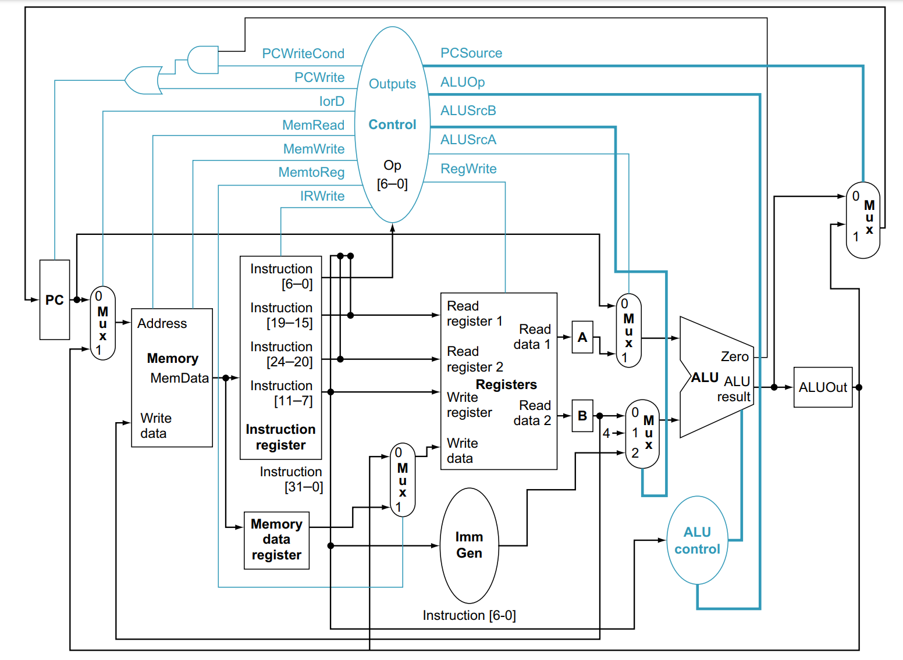

# Risco-5 Processor Core

## Introdução

O Risco-5 é um core RISC-V de 32 bits que implementa o conjunto de instruções básicas do RISC-V RV32I[M]. O Risco-5 é um processador multiciclo, com execução em ordem e sem pipeline. Foi projetado para ser simples e de fácil utilização, sendo útil nos mais diversos sistemas.

## Arquivos Fonte

Os arquivos do Risco-5 estão disponíveis na pasta "core/" dentro da pasta "src/", com o top model estando disponível no arquivo core.v.

## Parâmetros

| Nome           | Tamanho | Descrição              |
|----------------|---------|------------------------|
| BOOT_ADDRESS   | 32 bits | Endereço de boot       |

## Sinais

| Nome                | Direção | Tamanho | Descrição                                                            |
|---------------------|---------|---------|----------------------------------------------------------------------|
| clk                 | input   | 1 bit   | Sinal de clock                                                       |
| halt                | input   | 1 bit   | Para a execução do processador                                       |
| reset               | input   | 1 bit   | Sinal de reset                                                       |
| memory_response     | input   | 1 bit   | Resposta do barramento de memória; o core espera até que seja 1      |
| memory_read         | output  | 1 bit   | Habilita leitura na memória                                          |
| memory_write        | output  | 1 bit   | Habilita escrita na memória                                          |
| write_data          | output  | 32 bits | Valores saindo do core                                               |
| read_data           | input   | 32 bits | Valores vindos da memória                                            |
| address             | output  | 32 bits | Endereço de memória                                                  |
| option              | output  | 3 bits  | Formato a ser lido da memória                                        |

## Exemplo de Instância

A seguir está um exemplo de como instanciar o core Risco-5 em um módulo Verilog:

```verilog
Core #(
    .BOOT_ADDRESS(32'h00000000) // Endereço de boot - 32 bits
) Core_inst (
    /* controle */
    .clk(clk), // Sinal de clock - 1 bit
    .halt(halt), // Para a execução do processador - 1 bit
    .reset(reset), // Sinal de reset - 1 bit
    /* Dados */
    .memory_response(memory_response), // Resposta do barramento de memória, o core espera até que seja 1 - 1 bit
    .memory_read(memory_read), // Habilita leitura na memória - 1 bit
    .memory_write(memory_write), // Habilita escrita na memória - 1 bit
    .write_data(write_data), // Valores saindo do core - 32 bits
    .read_data(read_data), // Valores vindo da memória - 32 bits
    .address(address), // Endereço de memória - 32 bits
    .option(option) // Formato a ser lido da memória - 3 bits
);
```
## Maquina de estados da unidade de controle e Esquemático

**Versão PDF dos diagramas**
[Maquina de estados da unidade de controle](documents/risco5_state_machine.pdf)


[Esquemático do processador](documents/risco5_datapath.pdf)

#### Maquina de estados da unidade de controle


#### Esquemático do processador

**Esquemático atual**


**Esquemático Inicial**

